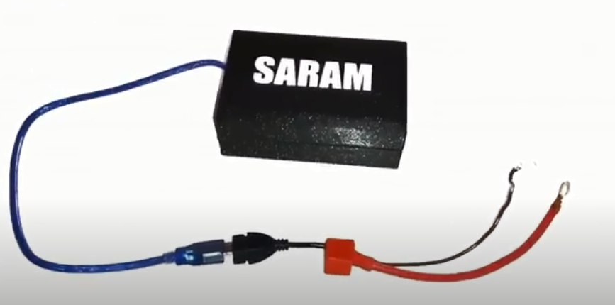
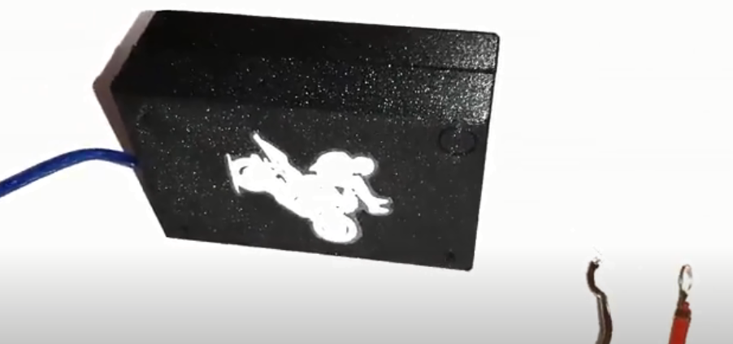
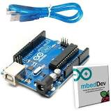
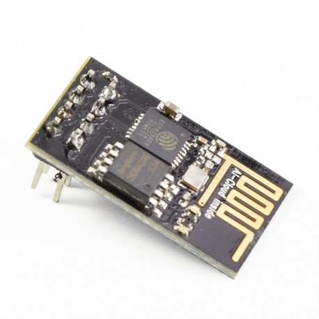
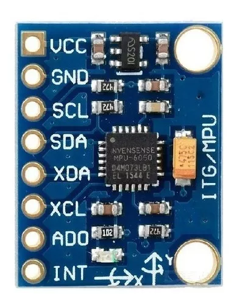
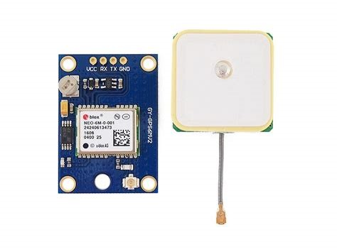
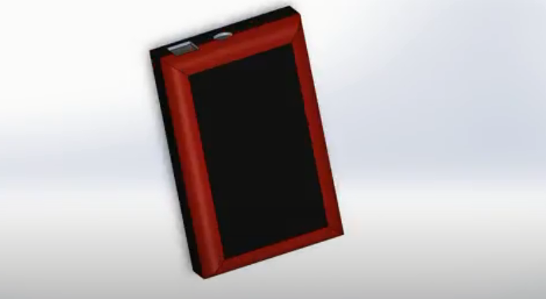
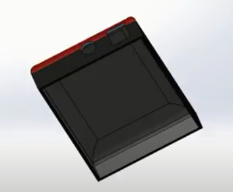
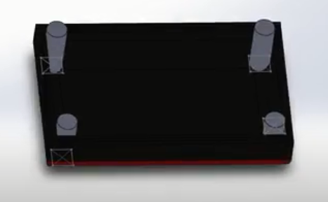

## **SARAM PROTOTIPO**

El dispositivo SARAM es un un sistema semi-automatizado capaz de monitorear el estado de una motocicleta, alojado en un dispositivo electrónico, que está compuesto por una placa de arduino, un sensor de posición (MPU 6050), un módulo WiFi (ESP 8266) y un módulo GPS NEO 6 que en su conjunto envía mensajes de alerta con ubicación en tiempo real para proporcionar una respuesta mediante un sistema web y/o aplicación móvil, con el objetivo de reducir el tiempo de atención a lesionados por este tipo de accidentes de tránsito.

### Funcionamiento

Puedes observar el funcionamiento del prototipo SARAM en los siguientes videos.

* [Video de funcionamiento 1](https://vimeo.com/562487078)
* [Video de funcionamiento 2](https://vimeo.com/562503063)

### Marco Teórico (Resumen)

#### Arduino

Arduino es una plataforma de desarrollo basada en una placa electrónica de hardware libre que incorpora un microcontrolador re-programable y una serie de pines hembra, los que permiten establecer conexiones entre el microcontrolador y los diferentes sensores y actuadores de una manera muy sencilla (principalmente con cables dupont).

Arduino es libre y extensible: esto quiere decir que cualquiera que desee ampliar y mejorar el diseño hardware de las placas como el entorno de desarrollo, puede hacerlo sin problemas. Esto permite que exista un rico ecosistema de placas electrónicas no oficiales para distintos propósitos y de librerías de software de terceros, que pueden adaptarse mejor a nuestras necesidades.

[Conocer más...](https://arduino.cl/arduino-uno/)

#### Módulo ESP8266

Está basado en el SoC (System on Chip) ESP8266, un chip altamente integrado, diseñado para las necesidades de un mundo conectado. Integra un potente procesador con arquitectura de 32 bits (más potente que el Arduino Due) y conectividad Wifi. Ofrece una completa y autocontenida solución WiFi Networking, permitiéndole trabajar como host de aplicaciones o reducir la carga de WiFi Networking de otro procesador. El módulo puede trabajar en 2 modos: como estación Wifi (Wifi Station) o como Punto de Acceso (Access Point), al trabajar como estación el módulo se conecta a la red Wifi presente en nuestro hogar. El modo Access Point se usa si se desea crear una red propia en el chip y así conectarse directamente.

El módulo ESP-01 viene cargado de fábrica con el firmware AT, que permite conectar un Arduino a wifi utilizando comandos AT. Es posible cambiar el firmware (flashear) permitiendo trabajar el módulo de forma independiente (sin un Arduino) y usar toda su capacidad como microcontrolador de 32bits a 80Mhz. Para flashear el chip es necesario utilizar un módulo conversor USB a serial TTL como el Módulo CP2102.

El módulo trabaja a 3.3V por lo que NO se debe alimentar con 5V. Se recomienda colocar un capacitor de 100uF en paralelo con la fuente de alimentación para filtrar los picos de corriente. Posee leds indicadores de alimentación y de comunicación.

[Conocer más...](https://naylampmechatronics.com/inalambrico/48-modulo-wifi-serial-esp-01-esp8266.html)

#### Acelerómetro MPU6050

El sensor está compuesto por 3 acelerómetros y 3 giróscopios, cada uno con su respectivo ADC de 16 bits. Presenta la posibilidad de modificar la escala de trabajo, proporcionando así más precisión para movimientos más lentos.

##### Sensor Giroscópico

Un giroscopio es un dispositivo que funciona para medir velocidades angulares basándose en el mantenimiento del impulso de rotación. Si intentamos hacer girar un objeto que está girando sobre un eje que no es el eje sobre el que está rotando, el objeto ejercerá un momento contrario al movimiento con el fin de preservar el impulso de rotación total.

El giroscopio muestra el cambio de rango en rotación en sus ejes X, Y y Z.

##### Acelerómetro

Mide la aceleración, inclinación o vibración y transforma la magnitud física de aceleración en otra magnitud eléctrica. Los rangos de medida van desde las décimas de g, hasta los miles de g.
El circuito integrado MPU-6050 contiene un acelerómetro y giroscopio MEMS en un solo empaque. Cuenta con una resolución de 16-bits, lo cual significa que divide el rango dinámico en 65536 fracciones, estos aplican para cada eje X, Y y Z al igual que en la velocidad angular. El sensor es ideal para diseñar control de robótica, medición de vibración, sistemas de medición inercial (IMU), detector de caídas, sensor de distancia y velocidad, y muchas cosas más. El MPU-6050 contiene un giroscópico, un acelerómetro, además de un sensor de temperatura, mediante I2C regresa unos valores conocidos como raw o “crudos” según el registro seleccionado.

[Conocer más...](https://hetpro-store.com/TUTORIALES/modulo-acelerometro-y-giroscopio-mpu6050-i2c-twi/)

#### Módulo GPS NEO 6

Este se encarga de obtener la ubicación haciendo una petición a la API de Google Maps. Es la familia de receptores GPS independientes que de acuerdo con el fabricante U-blox, ofrece la más alta calidad de motor de posicionamiento. Estos módulos se caracterizan principalmente por su bajo costo para su dimensión, ya que en el mercado es el módulo GPS más pequeño en comparación a su precio. NEO-6 está diseñado para trabajar tanto con antenas pasivas como activas. Se recomienda trabajar con antenas que tengan 15dB como mínimo, 50dB como máximo, y 1.5dB máximo de ruido.

Los módulos NEO-6 proporcionan pines para la configuración del tiempo de arranque. Estos entran en vigencia de inmediato Después de la puesta en marcha. Una vez que el módulo se ha iniciado, los ajustes de configuración se pueden modificar con la configuración de mensajes UBX.

La configuración modificada permanece vigente hasta que se apaga o reinicia. Si esta configuración ha sido almacenada en la RAM de respaldo de la batería, la configuración modificada se mantendrá, siempre que el suministro de la batería de respaldo no sea interrumpido.

Este módulo cuenta con la certificación Directive 2002/95/EC por European Parliament and the Council on the Restriction of Use of certain Hazardous Substances in Electrical and Electronic Equipment (RoHS). Está basado en la calidad AEC-Q100 de chips de GPS, testeado acorde al ISO 16750.

[Conocer más...](https://naylampmechatronics.com/blog/18_Tutorial-M%C3%B3dulo-GPS-con-Arduino.html)

### Modelos en 3D del molde del dipositivo SARAM

